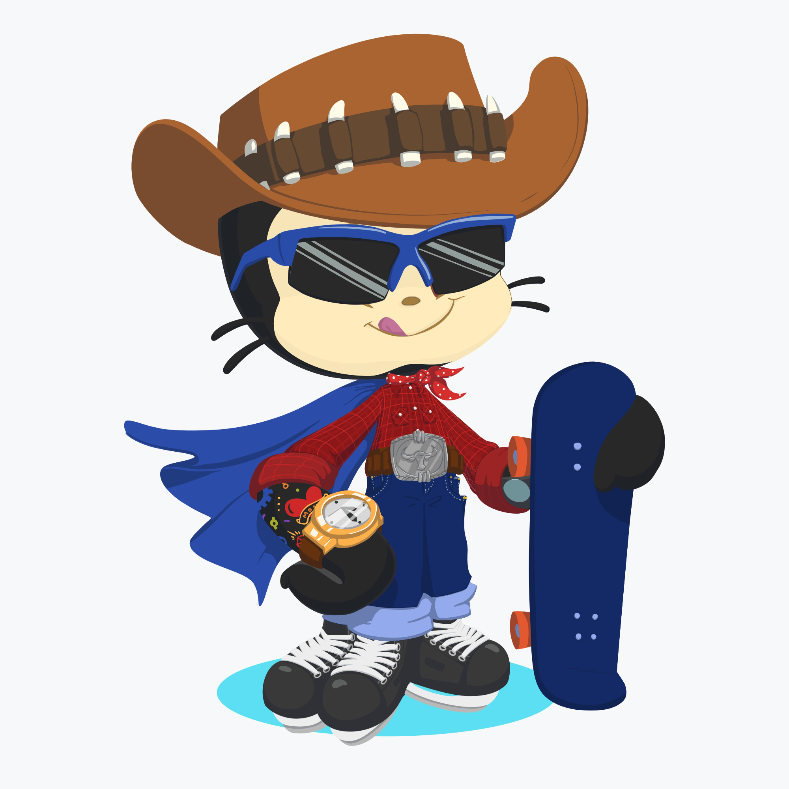

<h1 align="center">Yo ✌️, I'm ShubhanK</h1>
<h3 align="center">A budding developer keen to learn</h3>

  

<h2 align="center">My work is mostly realted to Cyber-Security and Web-Development</h2>
<h2 align="center"> 👨‍💻  Check out my repos to view some of my work   👨‍💻</h2>

  

                                                                                                                                           

- 🌱 I’m currently an undergrad at <b>NIT , Warangal</b> . 
- 📖 Learning new stuff is my hobby . 
- 👨‍💻 Fusing Coding to my DNA . 
- 💻 Learning js frameworks . 
- 🍔 Food is my life. 
- 💬 Ask me anythin .Happy to help . 
- 📫 Connect with me through linkedin , insta or via mail. 
- ⚡ <b>Fun fact: Banging your head against a wall for one hour burns 150 calories.</b> 

